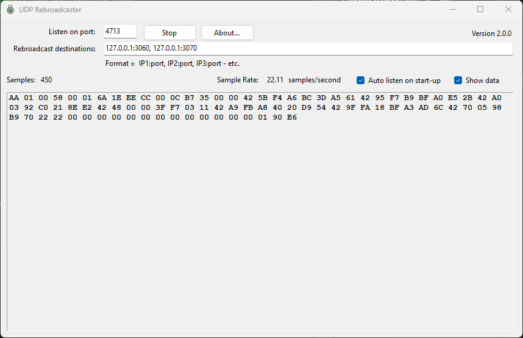

# UDP Rebroadcaster

A small Windows utility that listens for a UDP stream on a single port and rebroadcasts every received packet, byte-for-byte, to one or more downstream destinations. Useful for fanning a single UDP feed (PMU/PDC data, telemetry, video streams, log packets, etc.) out to multiple consumers without modifying the original publisher.



## Features

- One-to-many UDP rebroadcast — every received datagram is forwarded unchanged to each configured destination.
- Live throughput display (received sample count and rolling samples-per-second).
- Optional hex dump of the most recent packet for quick verification.
- Settings (listen port, destinations, auto-listen, window position) persist between runs.
- Single self-contained executable — no .NET runtime install required on target machines.

## Usage

1. Launch `UDPRebroadcaster.exe`.
2. **Listen on port** — enter the UDP port the source publisher sends to. The application binds `0.0.0.0:<port>`.
3. **Rebroadcast destinations** — enter one or more `host:port` targets separated by commas. `host` can be a literal IP (`127.0.0.1`, `192.168.1.50`) or a DNS name. Example:
   ```
   127.0.0.1:3060, archive01.example.com:3070, 10.0.0.42:3080
   ```
4. Click **Start** (the button toggles to **Stop** while listening).
5. **Samples** and **Sample Rate** update live as packets arrive.
6. Tick **Show data** to render a hex dump of the most recent packet in the lower panel. This costs CPU and may reduce retransmission throughput on very high-rate streams, so leave it off in production.
7. Tick **Auto listen on start-up** to skip the manual Start click on the next launch.
8. **About…** opens the version / disclaimer dialog.

### Settings persistence

On clean exit the application writes a small JSON file to:

```
%LocalAppData%\Grid Protection Alliance\UDP Rebroadcaster\settings.json
```

It stores listen port, rebroadcast destinations, the auto-listen flag, and the window's location / size / maximized state. If the file is missing or corrupt the defaults take over (port 3050, destinations `127.0.0.1:3060, 127.0.0.1:3070`).

## Design

The application is a thin WinForms front-end over two [Gemstone.Communication](https://www.nuget.org/packages/Gemstone.Communication) transports.

```
                                       ┌─────────────────────────┐
                                       │  Destinations from UI   │
                                       │  (host:port, host:port) │
                                       └────────────┬────────────┘
                                                    │
   source publisher ──► UDP :<listen-port>          │
                              │                     ▼
                              ▼            ┌──────────────────┐
                       ┌─────────────┐     │    UdpServer     │
                       │  UdpClient  │ ──► │ MulticastAsync() │ ──► destination 1
                       │ ReceiveData │     │                  │ ──► destination 2
                       │  Complete   │     │                  │ ──► destination N
                       └─────────────┘     └──────────────────┘
                              │
                              └──► (optional) hex dump + stats on UI thread
```

- **`UdpClient`** binds the listen port and raises a `ReceiveDataComplete` event for every datagram. The event hands back a `(byte[] buffer, int length)` pair via Gemstone's `EventArgs<T1, T2>`. Offset is always zero.
- **`UdpServer`** is configured with `port=-1; clients=<destinations>; interface=0.0.0.0` — `port=-1` skips inbound binding (it's transmit-only) and `clients` enumerates the rebroadcast endpoints. `MulticastAsync` queues each packet to every client without blocking the receive callback.
- The receive callback snapshots the buffer before posting any UI work via `BeginInvoke`, because Gemstone reuses the receive buffer between callbacks.
- Statistics (sample rate) are recomputed at a fixed 2-second cadence using `TimeSpan.TicksPerSecond` arithmetic, not per-packet, to keep the hot path cheap.
- The About dialog loads its logo and disclaimer text from embedded resources via `Assembly.GetManifestResourceStream`.
- Settings persistence is `System.Text.Json` against a single POCO — no `app.config`, no `ConfigurationManager`.

### Project layout

| File | Purpose |
| --- | --- |
| `Program.cs` | Entry point; `ApplicationConfiguration.Initialize()` + `Application.Run`. |
| `UDPRebroadcaster.cs` / `.Designer.cs` | Main form. Wires the Gemstone transports and drives the UI. |
| `AboutBox.cs` / `.Designer.cs` | About dialog (logo, version, copyright, disclaimer, URL). |
| `AppSettings.cs` | JSON-backed settings + window-layout capture/restore. |
| `HelpAboutLogo.png`, `Disclaimer.txt` | Embedded resources displayed by the About dialog. |
| `GPA.ico` | Application icon. |

## Build & deployment

Requires the **.NET 9 SDK**. From the project directory:

```powershell
# Debug build
dotnet build

# Release build
dotnet build -c Release

# Self-contained single-file executable (win-x64)
dotnet publish -c Release
```

The published artifact lands at:

```
bin\Release\net9.0-windows\win-x64\publish\UDPRebroadcaster.exe
```

It is a self-contained executable — the .NET runtime is bundled, so no framework install is needed on the target machine. The `csproj` sets `<PublishSingleFile>true</PublishSingleFile>`, `<SelfContained>true</SelfContained>`, and `<RuntimeIdentifier>win-x64</RuntimeIdentifier>` for this configuration.

## History

| Year | Change |
| --- | --- |
| 2005 | Original VB.NET / .NET 2.0 implementation, built against the TVA shared code libraries. |
| 2011 | Ported to C# / .NET Framework 4 using the TVA Code Library (later renamed Grid Solutions Framework). |
| 2026 | Ported to C# / .NET 9 using the [Gemstone Libraries](https://github.com/gemstone) — the .NET Core successor to GSF. Switched configuration to JSON, replaced removed `TVA.Windows.Forms` helpers with inline implementations, and adopted a self-contained single-file publish. |

## License

[MIT](LICENSE) — Copyright © 2005-2026 Grid Protection Alliance.
