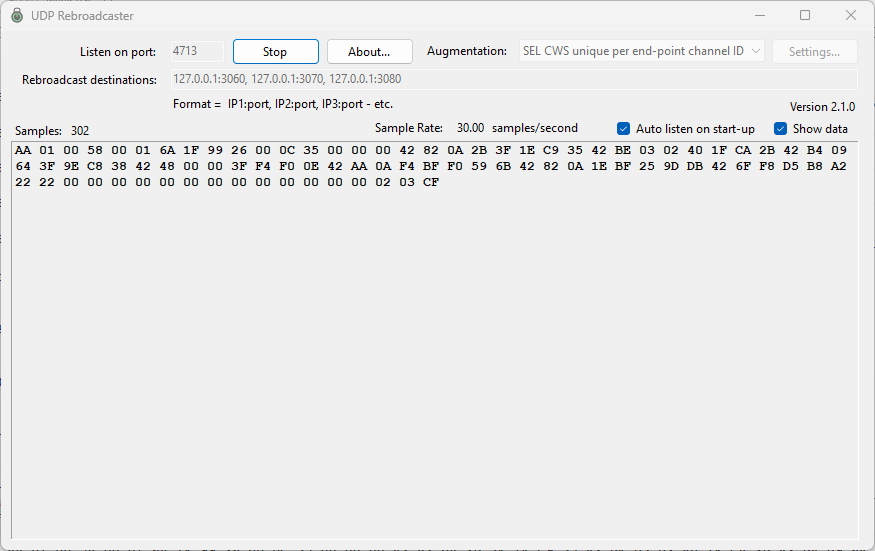

# UDP Rebroadcaster

A small Windows utility that listens for a UDP stream on a single port and rebroadcasts every received packet to one or more downstream destinations. Useful for fanning a single UDP feed (PMU/PDC data, telemetry, video streams, log packets, etc.) out to multiple consumers without modifying the original publisher. Supports optional, pluggable per-destination packet transformations ("augmentations") for protocol-specific scenarios such as making each rebroadcast copy distinguishable to a receiver that listens on a single port. Augmentations can declare a settings dialog so per-augmentation tuning happens in the UI rather than by hand-editing JSON.



## Features

- One-to-many UDP rebroadcast — every received datagram is forwarded to each configured destination.
- **Pluggable augmentation pipeline** for protocol-specific per-destination transformations; ships with a built-in SEL CWS Channel ID rewriter.
- **Per-augmentation settings dialog** — augmentations can declare a settings form (via `[SettingsForm(typeof(…))]`) that the main form opens behind a dedicated `Settings…` button.
- Zero per-packet heap allocation on the hot path — receive buffer is mutated in place via `Span<byte>` and reused across all destinations.
- Live throughput display (received sample count and rolling samples-per-second).
- Optional hex dump of the most recent (incoming, pre-augmentation) packet for quick verification.
- Listen port, destinations, augmentation selection, and the augmentation `Settings…` button all lock while the listener is running so they can't be silently "changed" mid-session.
- Settings (listen port, destinations, auto-listen, augmentation, per-augmentation tuning, window position) persist between runs.
- Single self-contained executable — no .NET runtime install required on target machines.
- **Zero NuGet package dependencies** — pure BCL.

## Usage

1. Launch `UDPRebroadcaster.exe`.
2. **Listen on port** — enter the UDP port the source publisher sends to. The application binds `0.0.0.0:<port>`.
3. **Rebroadcast destinations** — enter one or more `host:port` targets separated by commas. `host` can be a literal IP (`127.0.0.1`, `192.168.1.50`) or a DNS name. Example:
   ```
   127.0.0.1:3060, archive01.example.com:3070, 10.0.0.42:3080
   ```
4. **Augmentation** — leave at **None** for byte-for-byte rebroadcast. Pick a protocol-aware augmentation to rewrite per-destination payloads — see [Augmentations](#augmentations) below.
5. **Settings…** — opens the selected augmentation's settings dialog. Disabled when the selected augmentation has no settings form (e.g., **None** augmentation selection) and while the listener is running. See [Augmentation settings dialog](#augmentation-settings-dialog) for details.
6. Click **Start** (the button toggles to **Stop** while listening). Port, Destinations, Augmentation, and Settings… controls all disable on Start — they're captured once and changes don't take effect until the next Start.
7. **Samples** and **Sample Rate** update live as packets arrive.
8. Tick **Show data** to render a hex dump of the most recent packet (incoming bytes, before any augmentation) in the lower panel. The hex string is formatted on the receive thread; expect some throughput cost on high-rate streams. Leave off in production.
9. Tick **Auto listen on start-up** to skip the manual Start click on the next launch.
10. **About…** opens the version / disclaimer dialog.

### Settings persistence

On clean exit the application writes a small JSON file to:

```
%LocalAppData%\Grid Protection Alliance\UDP Rebroadcaster\settings.json
```

It stores listen port, rebroadcast destinations, the auto-listen flag, the selected augmentation (by type name), per-augmentation settings sections (e.g., `SELCWSChannelID`), and the window's location / size / maximized state. If the file is missing or corrupt the defaults take over (port 3050, destinations `127.0.0.1:3060, 127.0.0.1:3070`, augmentation `NoAugmentation`).

## Augmentations

An augmentation is a per-destination transformation applied to each datagram on its way out. Implementations are discovered by reflection at startup, and a `[Label("…")]` attribute supplies the drop-down text. The pipeline mutates the receive buffer in place across all destinations, so the steady-state hot path makes zero per-packet heap allocations.

### Built-in augmentations

| Label | Type | Behavior |
| --- | --- | --- |
| **None** | `NoAugmentation` | Pass-through. Bytes sent to every destination are identical to bytes received. Both pipeline methods are empty bodies — true zero-work no-op. |
| **SEL CWS unique per end-point channel ID** | `SELCWSChannelIDAugmentation` | Rewrites the `Uint64` ChannelID at offset 6 of each SEL CWS frame (configuration or data) so the destination at index `N` receives either `originalChannelID + (N + 1)` (Incremented mode) or a fresh random `Uint64` per destination (Random mode, generated once at Start). For **configuration frames** also overwrites the variable-length null-terminated UTF-8 `ChannelName` field (located at offset `24 + 4 * NumAnalogs`, capped at 21 bytes total per spec) with the per-destination station label picked in the **Settings…** dialog — the variable-length tail (`SignalNames` — N packed null-terminated UTF-8 names) shifts to its new offset verbatim and the frame's `Size` header is updated to match. Configuration vs. data is determined by the FrameID's type byte against the `FrameType` enum (`DataFrame = 0x00`, `ConfigurationFrame = 0x01`). Lets multiple copies of one upstream SEL CWS stream be sent to the *same* downstream receiver (e.g., the SEL CWS Receiver in the SEL SynchroWave Rebroadcaster, which listens on a single port) and remain disambiguable. SEL CWS has no checksum, so neither rewrite requires a recompute. Non-SEL-CWS packets pass through unchanged. |

### Scaling-up testing example

Point a single SEL 735 (or any SEL CWS source) at the rebroadcaster, set three identical destinations:

```
127.0.0.1:3050, 127.0.0.1:3050, 127.0.0.1:3050
```

…and pick **SEL CWS unique per end-point channel ID**. The downstream SEL CWS Receiver listening on `3050` now sees three streams with channel IDs `original+1`, `original+2`, `original+3` — three logical channels driven by one hardware device.

### Augmentation settings dialog

The main form's **Settings…** button (immediately right of the augmentation drop-down) opens the selected augmentation's settings dialog. The button is **enabled** only when both:

1. The selected augmentation declares a settings form via `[SettingsForm(typeof(…))]`.
2. The listener is stopped — same lock-during-listen pattern as the other capture-at-Start controls. Stop, change settings, Start to apply.

#### SEL CWS Channel ID settings

When **SEL CWS unique per end-point channel ID** is selected, **Settings…** brings up:

- **Unique Channel ID Generation**
  - **Incremented** — destination *N* receives `originalChannelID + (N + 1)`. Default; deterministic; preserves a relation to the original ID.
  - **Random** — destination *N* receives a fresh random `ulong` generated once at Start. Stable for the lifetime of the listening session; fresh on the next Start.
- **Configuration Frame Station Labels** — one text box per current destination (vertically scrolling for large fan-outs). The label is written into the configuration frame's variable-length `ChannelName` field as null-terminated UTF-8 per SEL-735 IM Appendix J Table J.3, the `SignalNames` field shifts to its new offset, and the `Size` header updates to match. Labels are capped at 20 UTF-8 bytes of content to stay within the spec's 21-byte ChannelName ceiling; longer input is truncated at write time. Data frames are untouched.

Defaults — `STATION_A`, `STATION_B`, … `STATION_Z`, then `STATION_AA`, `STATION_AB`, … — materialize automatically the moment SEL CWS is selected or the destinations field is edited, even if you never open the dialog. Existing labels are preserved when destinations are added or temporarily removed.

OK persists the changes to `settings.json` immediately; Cancel discards.

### Adding a new augmentation

Drop a class into `src/Augmentations/`, decorate it with `[Label("…")]`, and implement `IRebroadcastAugmentation`. The drop-down picks it up automatically on next launch.

```csharp
using System.Net;
using UDPRebroadcaster.Augmentations;

[Label("My new transformation")]
internal sealed class MyAugmentation : IRebroadcastAugmentation
{
    public void Initialize(IReadOnlyList<IPEndPoint> destinations)
    {
        // One-shot setup at Start. Stash any per-session state derived from the destination list.
    }

    public void BeginPacket(ReadOnlySpan<byte> source)
    {
        // Called once per received packet, before the fan-out loop. Snapshot anything you'll
        // need to derive per-destination payloads, since TransformForDestination overwrites
        // the same buffer in place.
    }

    public ReadOnlySpan<byte> TransformForDestination(Span<byte> buffer, int destinationIndex)
    {
        // Called once per destination, in ascending order (0..N-1). Mutate buffer in place and
        // return the slice that should be sent. Same-length rewrites: return buffer. Shrinks:
        // return a prefix slice. Grows past buffer.Length: back the rewrite with an
        // augmentation-owned scratch buffer (pre-allocated in Initialize) and return a slice
        // into that. The returned slice is consumed immediately by a synchronous Send call.
        return buffer;
    }
}
```

Threading: the receive loop guarantees the three methods are called serialized for a given instance, so implementations don't need to be thread-safe.

Ordering: `NoAugmentation` is always pinned to the top of the drop-down; everything else is sorted alphabetically by label.

#### Giving your augmentation a settings dialog

Two pieces, both optional:

1. **Decorate the augmentation** with `[SettingsForm(typeof(MySettingsForm))]`. Its presence is what enables the main form's **Settings…** button for that drop-down entry.
2. **Implement `IConfigurableAugmentation`** so the runtime can hand the augmentation its settings before `Initialize`, and so per-destination defaults stay in sync without requiring a trip through the dialog.

```csharp
[Label("My new transformation")]
[SettingsForm(typeof(MySettingsForm))]
internal sealed class MyAugmentation : IRebroadcastAugmentation, IConfigurableAugmentation
{
    private MySettings m_settings = new();

    public void ApplySettings(AppSettings settings) => m_settings = settings.MySettings;

    public void SynchronizeDefaults(AppSettings settings, int destinationCount)
    {
        // Pad per-destination defaults into settings.MySettings to match destinationCount.
        // Preserve existing entries — don't truncate; shrink-then-grow shouldn't lose user input.
    }

    // …existing IRebroadcastAugmentation methods…
}
```

The settings form's constructor must be `public MySettingsForm(AppSettings settings, IReadOnlyList<IPEndPoint> destinations)` — the main form instantiates it via `Activator.CreateInstance` with exactly those two arguments, in that order. On OK, write your changes back into `settings` and call `settings.Save()`; on Cancel, do nothing. Add a typed section property to `AppSettings` (e.g., `public MySettings MySettings { get; set; } = new();`) so the section serializes as its own JSON block alongside `SELCWSChannelID`.

The main form re-runs `SynchronizeDefaults` on these triggers: augmentation drop-down selection change, destinations text box `Leave`, before opening the settings dialog, and in `FormClosing`. A transient augmentation instance is created solely to dispatch the call — `Initialize` is **not** invoked, so don't put expensive setup behind `SynchronizeDefaults`'s constructor.

## Design

```
   source publisher ──► UDP :<listen-port>
                              │
                              ▼   ReceiveAsync (BCL UdpClient, background task)
                  ┌────────────────────────────┐
                  │   HandleReceivedDatagram   │
                  └──────────┬─────────────────┘
                             │
                             ▼
              augmentation.BeginPacket(span)   ◄── snapshot per-packet state
                             │
                  ┌──────────┴───────────────────────┐
                  │  for i = 0..N-1:                 │
                  │    out = Transform(span, i)      │  ◄── mutate in place (or scratch),
                  │    Send(out, dest[i])            │      return slice to send
                  └──────────────────────────────────┘ ──► destination i  (BCL UdpClient)

  ShowData on?    hex string formatted synchronously on the receive thread (before fan-out),
                  then marshaled to the UI thread via BeginInvoke as an immutable string.
```

- **Receive** — a single `System.Net.Sockets.UdpClient` bound to `0.0.0.0:<listen-port>`. A `Task.Run`-spawned async loop awaits `ReceiveAsync(CancellationToken)`; each `UdpReceiveResult.Buffer` is a fresh `byte[]` owned exclusively by that packet's pipeline (no buffer-reuse hazards to defend against).
- **Send** — a single `System.Net.Sockets.UdpClient` on an ephemeral local port plus a pre-resolved `IPEndPoint[]` (one entry per destination, in user-typed order). DNS resolution happens once at Start. Per-packet sends use `Send(ReadOnlySpan<byte>, IPEndPoint?)` — no `byte[]` allocation per send. The synchronous `Send` copies into the kernel send buffer before returning, which is the safety guarantee that lets the next iteration mutate the same span.
- **Augmentation** — `BeginPacket(ReadOnlySpan<byte> source)` runs once per packet to snapshot per-packet state; `TransformForDestination(Span<byte> buffer, int destinationIndex)` runs once per destination and returns the exact slice to send. Same-length rewrites mutate `buffer` in place and return it; shrinks return a prefix; grows back the rewrite with an augmentation-owned scratch buffer (pre-allocated in `Initialize`) and return a slice into it. The receive loop hands the returned slice straight to `UdpClient.Send`, which copies synchronously — so the slice's validity only needs to outlive that single call.
- **Hex display** — when `Show data` is on, the hex string is built on the receive thread *before* the fan-out begins (via `Convert.ToHexString(ReadOnlySpan<byte>)`) and marshaled to the UI thread as an immutable string. This avoids both a per-packet `byte[]` snapshot allocation and any race against the in-place mutation.
- **Stop** — `CancellationTokenSource.Cancel()` first (so the loop sees `IsCancellationRequested` even if it was about to issue another `ReceiveAsync`), then `Dispose()` the receive client (unblocks an in-flight receive). `OperationCanceledException`, `ObjectDisposedException`, and `SocketException` inside the loop are all expected on Stop and silently swallowed.
- **Statistics** — sample-rate update gated on a 2-second wall-clock window (`TimeSpan.TicksPerSecond * 2`), not per-packet, so high-rate streams don't pay UI marshaling overhead on every datagram.
- **Settings + About** — `System.Text.Json` POCO under `%LocalAppData%`. The About dialog loads its logo and disclaimer from embedded resources via `Assembly.GetManifestResourceStream`.

### Allocation budget per packet

| Mode | Heap allocations |
| --- | --- |
| `ShowData` off, `NoAugmentation` | 0 (excluding the receive buffer itself) |
| `ShowData` off, `SELCWSChannelIDAugmentation`, N destinations | 0 |
| `ShowData` on, any augmentation | 1 — the hex display string |

### Project layout

| File / Folder | Purpose |
| --- | --- |
| `Program.cs` | Entry point; `ApplicationConfiguration.Initialize()` + `Application.Run`. |
| `UDPRebroadcaster.cs` / `.Designer.cs` | Main form. Owns the receive loop, send socket, augmentation pipeline, and the `Settings…` button wiring. |
| `AboutBox.cs` / `.Designer.cs` | About dialog (logo, version, copyright, disclaimer, URL). |
| `AppSettings.cs` | JSON-backed settings + window-layout capture/restore. Holds per-augmentation sections (e.g., `SELCWSChannelID`). |
| `Augmentations/IRebroadcastAugmentation.cs` | The pluggable contract — `BeginPacket` + `TransformForDestination`. |
| `Augmentations/IConfigurableAugmentation.cs` | Optional companion interface — `ApplySettings`, `SynchronizeDefaults`. |
| `Augmentations/LabelAttribute.cs` | Drop-down label attribute. |
| `Augmentations/SettingsFormAttribute.cs` | Settings-dialog declaration attribute; presence enables the `Settings…` button. |
| `Augmentations/AugmentationDiscovery.cs` | Reflection scan; produces `AugmentationOption` items the combo binds to directly. |
| `Augmentations/NoAugmentation.cs` | Default pass-through implementation. |
| `Augmentations/FrameType.cs` | SEL CWS frame-type enum (`DataFrame = 0x00`, `ConfigurationFrame = 0x01`) — authoritative source for FrameID type-byte values. |
| `Augmentations/SELCWSChannelIDAugmentation.cs` | SEL CWS Channel ID rewriter + (for configuration frames) station-label rewriter. |
| `Augmentations/SELCWSChannelIDSettings.cs` | POCO persisted as `AppSettings.SELCWSChannelID`. |
| `Augmentations/SELCWSChannelIDSettingsForm.cs` / `.Designer.cs` | Settings dialog for the SEL CWS augmentation. |
| `HelpAboutLogo.png`, `Disclaimer.txt` | Embedded resources displayed by the About dialog. |
| `GPA.ico` | Application icon. |

## Build & deployment

Requires the **.NET 9 SDK**. From the `src/` directory:

```powershell
# Debug build
dotnet build

# Release build
dotnet build -c Release

# Self-contained single-file executable (win-x64)
dotnet publish -c Release
```

The published artifact lands at:

```
src\bin\Release\net9.0-windows\win-x64\publish\UDPRebroadcaster.exe
```

The `.csproj` has **zero `<PackageReference>` entries** — the application depends only on the BCL. `<PublishSingleFile>true</PublishSingleFile>`, `<SelfContained>true</SelfContained>`, and `<RuntimeIdentifier>win-x64</RuntimeIdentifier>` configure the single-file deployment, so no .NET runtime install is needed on the target machine.

## History

| Year | Change |
| --- | --- |
| 2005 | Original VB.NET / .NET 2.0 implementation, built against the TVA shared code libraries. |
| 2011 | Ported to C# / .NET Framework 4 using the TVA Code Library (later renamed Grid Solutions Framework). |
| 2026 | Ported to C# / .NET 9 using the [Gemstone Libraries](https://github.com/gemstone) — the .NET Core successor to GSF. Switched configuration to JSON, replaced removed `TVA.Windows.Forms` helpers with inline implementations, and adopted a self-contained single-file publish. |
| 2026 | Added pluggable per-destination augmentation pipeline; built-in SEL CWS Channel ID rewriter for one-stream → many-receivers-on-one-port testing. Dropped the Gemstone dependency in favor of the BCL `System.Net.Sockets.UdpClient` for both receive and send. Augmentation pipeline rewritten around `Span<byte>` for a zero-allocation hot path. |
| 2026 | Added per-augmentation settings UI: augmentations declare a settings form via `[SettingsForm(typeof(…))]`, opt into `IConfigurableAugmentation` for tunables and per-destination defaults. SEL CWS augmentation wired up first — Incremented/Random channel-ID mode plus per-destination configuration-frame station labels. Main form gains the `Settings…` button. |

## License

[MIT](LICENSE) — Copyright © 2005-2026 Grid Protection Alliance.
